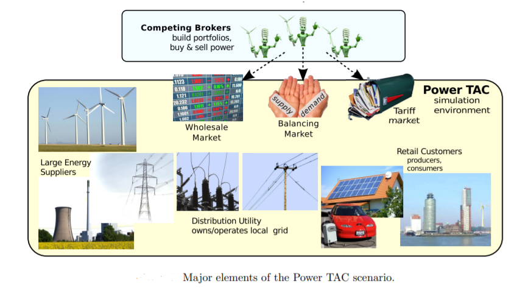

<!-- 
Text can be **bold**, _italic_, or ~~strikethrough~~.

[Link to another page](./another-page.html).

There should be whitespace between paragraphs.

There should be whitespace between paragraphs. We recommend including a README, or a file with information about your project.

# Header 1

This is a normal paragraph following a header. GitHub is a code hosting platform for version control and collaboration. It lets you and others work together on projects from anywhere.

## Header 2

> This is a blockquote following a header.
>
> When something is important enough, you do it even if the odds are not in your favor.

### Header 3

```js
// Javascript code with syntax highlighting.
var fun = function lang(l) {
  dateformat.i18n = require('./lang/' + l)
  return true;
}
```

```ruby
# Ruby code with syntax highlighting
GitHubPages::Dependencies.gems.each do |gem, version|
  s.add_dependency(gem, "= #{version}")
end
```

#### Header 4

*   This is an unordered list following a header.
*   This is an unordered list following a header.
*   This is an unordered list following a header.

##### Header 5

1.  This is an ordered list following a header.
2.  This is an ordered list following a header.
3.  This is an ordered list following a header.

###### Header 6

| head1        | head two          | three |
|:-------------|:------------------|:------|
| ok           | good swedish fish | nice  |
| out of stock | good and plenty   | nice  |
| ok           | good `oreos`      | hmm   |
| ok           | good `zoute` drop | yumm  |

### There's a horizontal rule below this.

* * *

### Here is an unordered list:

*   Item foo
*   Item bar
*   Item baz
*   Item zip

### And an ordered list:

1.  Item one
1.  Item two
1.  Item three
1.  Item four

### And a nested list:

- level 1 item
  - level 2 item
  - level 2 item
    - level 3 item
    - level 3 item
- level 1 item
  - level 2 item
  - level 2 item
  - level 2 item
- level 1 item
  - level 2 item
  - level 2 item
- level 1 item

### Small image


### Large image


### Definition lists can be used with HTML syntax.

<dl>
<dt>Name</dt>
<dd>Godzilla</dd>
<dt>Born</dt>
<dd>1952</dd>
<dt>Birthplace</dt>
<dd>Japan</dd>
<dt>Color</dt>
<dd>Green</dd>
</dl>

```
Long, single-line code blocks should not wrap. They should horizontally scroll if they are too long. This line should be long enough to demonstrate this.
```

```
The final element.
```
 -->
 
 
# Introduction

In modern day, “smart grid” components can record energy usage in real time and help consumers better manage their energy usage. However, Energy prices that reflect energy surplus and scarcity can motivate consumers to micromanage their loads to minimize cost, and producers to better transmit their supply capacities. There is a large capacity reservoir for grid management and balancing among customer populations, such as water heaters, EV batteries, and cold-storage houses. The effective pricing and demand response can play a significant role in developing a more sustainable energy infrastructure based on increasing proportions of variable-output sources, such as wind & solar energy. 

The performance of markets depends on economically motivated behavior of the participants, but proposed retail energy markets are too complex for game-theoretic analysis. Agent-based simulation environments have been used to study the wholesale energy market operations, but they didn't explore the range of unanticipated destructive behaviors of the participants. On the other hand, Smart grid pilot projects are limited to test system dynamics for extreme situations. They lack the competitiveness of open markets, because a single project typically controls and optimizes the interaction of all parts of the pilot regions. Therefore, Power TAC is an competitive market simulation platform to address the need for policy guidance based on robust research on the structure and operation of retail energy markets. These results will help policy makers create institutions to produce the intended incentives for energy producers and consumers. This leads to development and validation of intelligent automation technologies for effective management of retail entities.

# Overview of Competition 

In this competition involving simulated ecosystem, participating teams will construct trading agents to act as self-interested brokers that aggregate energy supply and demand with an objective of earning a profit. In the real world, brokers could be energy retailers, municipal utilities, or cooperatives. Brokers will buy & sell energy through contracts with retail customers (households, small and medium enterprises, owners of electric vehicles), and by trading energy in a wholesale market that models a real-world European or North American wholesale energy markets.

Broker agents are challenged to operate profitably by planning and executing activities in three markets - a customer market, a wholesale market, and a balancing market. In any simulation over several weeks, brokers build portfolios of consumer, producer, and electric vehicle customers by offering tariff contracts with price specs and other incentives. At the operational level over 24 simulated hours, brokers must balance the fluctuating energy demands of their contracted consumers against the energy supply of their contracted producers. Estimated differences between supply and demand must be accommodated through price signals (demand response), by exercising controls on customer capacity (demand management), and by trading energy in the wholesale market. Residual imbalances between supply and demand in the portfolio are resolved in the balancing market, by exercising control over customer resources and wholesale regulation resources. Thus, Retail market dynamics influence the wholesale market and vice versa.

The main goals of the brokers in the competition are listed below:
 - To develop a good-quality set of tariff subscriptions and individual contracts with customers who will sell or purchase energy. The ideal portfolio is profitable and balanced, in expectation, over a range of environmental conditions. 
 - To manage financial and supply/demand imbalance risks. A broker benefits from having reasonably-priced energy sources that can produce energy when peak demand is expected within its load portfolio. 
 - Modelling customers and predicting their behaviour is important. Uncertainity can be improved with a balanced portfolio of uncorrelated generation capacities and loads that can balance each other in real-time.
 - Understanding competitor's behaviour in wholesale markets and then optimizing trading strategies to minimize the overall broker cost. 
 - By acquiring storage capacity, flexible consumption and generation capacities (balancing capacity), by selling variable-price contracts, and by trading future energy supply contracts on the wholesale market leads to a profitable customer portfolio.

<p align="center">  </p>

# Contributions 

In developing a successful autonomous trading broker for Power Trading Agent Competition, I have contributed in designing and developing the following modules.
  - A customer behaviour prediction based on price, weather and time using traditional time series forecasting techniques and deep learning models such as FFNs, CNNs and RNNs.
  - A risk adjusted strategy based on statistical supply behaviour modelling to reduce the overall cost for trading power in wholesale and balancing markets.
  - A constrained optmization strategy for balanced and profitable customer portfolio management in retail market.

_NOTE: There is only limited information regarding the project implementation and no project code here due to TCS confidentiality and Intellectual property rights_

# Research Outcomes

1. VidyutVanika - a robust autonomous profitable broker which lead to winning the PowerTAC-2021. 
2. A system paper based on winning strategies of VidyutVanika-2021 (under submission).
3. A constrained optimization strategy for optimal portfolio management in electricity retail market (under submission).
4. A trade dynamics model based auction strategy to optimize power procurement costs in wholesale market (under submission).
 
# References
1. https://powertac.org/tournament/
2. https://dx.doi.org/10.2139/ssrn.3564107